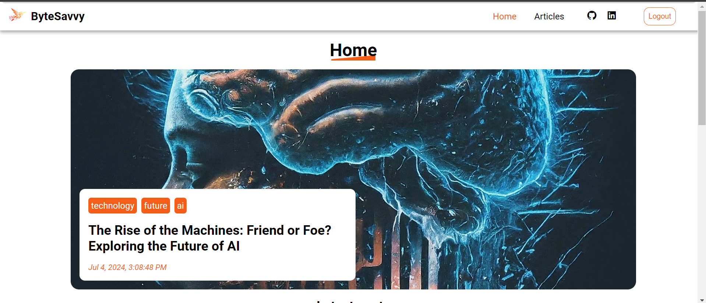
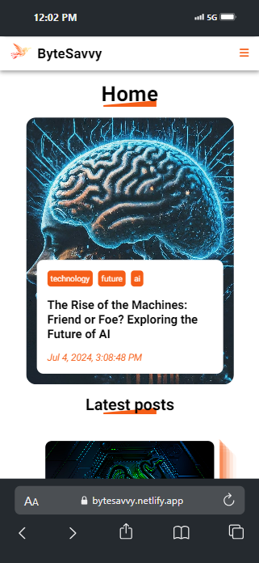
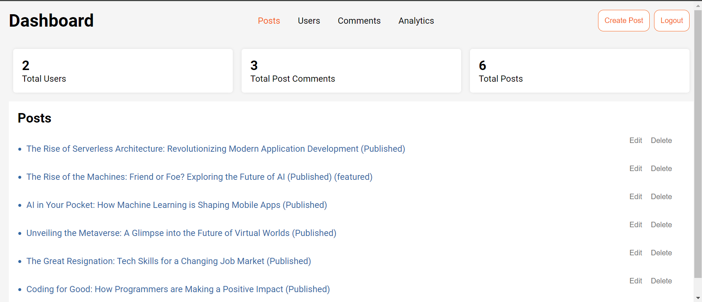
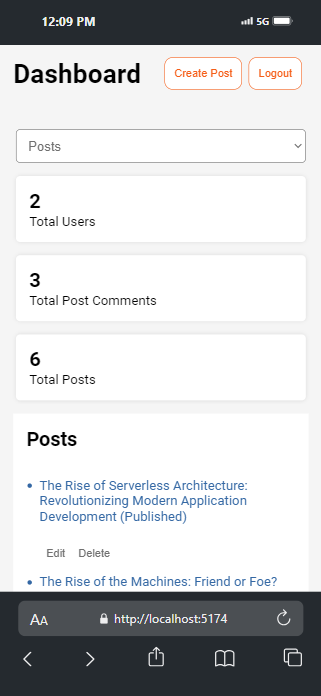

# Fullstack MERN Blog Project

This is a full-stack blog application built using the MERN stack (MongoDB, Express.js, React, Node.js). The project consists of three main components:

1. **Blog-Backend** - The backend server
2. **Blog-frontend-admin** - The admin panel
3. **Blog-frontend-client** - The client site

## Table of Contents

- [Features](#features)
- [Screenshots](#screenshots)
- [Installation](#installation)
- [Backend](#backend)
- [Frontend Admin](#frontend-admin)
- [Frontend Client](#frontend-client)
- [Environment Variables](#environment-variables)
- [Usage](#usage)
- [License](#license)

## Features

- User authentication and authorization
- Create, read, update, and delete posts
- Commenting on posts
- Rich text editor for writing posts
- Admin panel for managing posts and users
- Responsive design

## Screenshots

### Desktop Client Site


### Mobile Client Site


### Desktop Admin Pannel


### Mobile Admin Pannel



## Installation

### Prerequisites

Make sure you have the following installed:

- Node.js
- Express
- React
- npm
- MongoDB

### Cloning the Repository

```sh
git https://github.com/munyite001/Fullstack-Blog
cd Fullstack-blog
```

### Backend
#### Setup

Navigate to the backend directory:

```sh
cd Blog-Backend
```
#### Install dependencies:

```sh
npm install
```
#### Set up environment variables in a .env file:
- MONGO_URI=<your-mongodb-uri>
- JWT_SECRET=<your-jwt-secret>

#### Start the backend server:
```sh
npm run devstart
```
#### Available Scripts
```sh
npm run devstart

- Runs the backend server in development mode.
```

### Frontend Admin

#### Setup

- Navigate to the admin frontend directory:

```sh
cd Blog-frontend-admin
```

#### Install dependencies:
```sh
npm install
```

#### Set up environment variables in a .env file:

VITE_BACKEND_URL=<your-backend-url>

#### Start the admin panel:

```sh
npm run dev
```

#### Available Scripts`
```sh
npm run dev: 

- Runs the admin panel in development mode.
```


### Frontend Client

#### Setup

- Navigate to the client frontend directory:

```sh
cd Blog-frontend-client
```

#### Install dependencies:
```sh
npm install
```

#### Set up environment variables in a .env file:
VITE_BACKEND_URL=<your-backend-url>


#### Start the client site:
```sh
npm run dev
```
#### Available Scripts
```sh
npm run dev: 

- Runs the client site in development mode.
```

#### Environment Variables
Each part of the project requires environment variables for configuration. These should be stored in a .env file at the root of each respective directory.

For the backend:

1. MONGO_URI=<your-mongodb-uri>
2. JWT_SECRET=<your-jwt-secret>

For the frontends (both admin and client):

1. VITE_BACKEND_URL=<your-backend-url>

#### Usage
After setting up the backend and frontend components, you can access:

- The client site at http://localhost:5173 (or another port if specified)
- The admin panel at http://localhost:5174 (or another port if specified)
You can now register as a user, create posts, and manage content through the admin panel.

To prevent Security issues, I got rid of the Admin Signup page, but you can use the default 
admin login credentials 

- username: admin
- password: 1234

#### License
This project is licensed under the MIT License. See the LICENSE file for more information.
